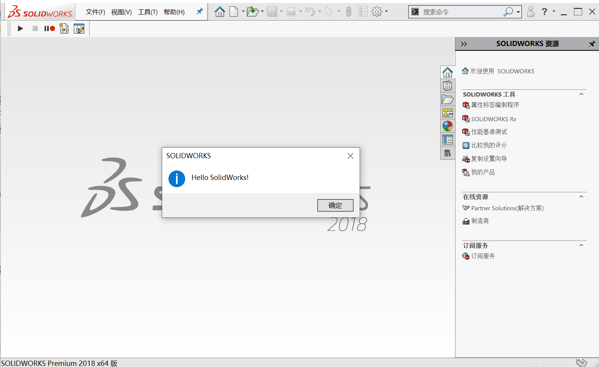

# 连接SolidWorks

## 独立应用程序

独立应用程序(进程外程序)使用Com组件来连接应用程序。可以使用Winform，WPF，控制台来开发独立应用程序。

## 创建控制台项目

### 使用Visual Studio 创建一个基于.net framework的控制台项目


## 获取SolidWorks进程

独立应用程序(StandAlone)需要获取当前打开的SolidWorks然后连接它，或者去打开一个SolidWorks。我们先看一下如何用C#获取当前已经打开的SolidWorks。

```csharp

//获取运行中的SolidWorks
var swProcess = System.Diagnostics.Process.GetProcessesByName("SLDWORKS");

```

这里我们使用了Process类的静态方法GetProcessesByName来获取名字叫做"SLDWORKS"的进程。
接下来我们就要判断有没有获取到SolidWorks的进程。

```csharp
 //判断SolidWorks是否被打开
if (!swProcess.Any())
{
    Console.WriteLine("SolidWorks 没有打开");
    Console.ReadKey();

    //启动18版的SolidWorks
    var swApp = SwApplicationFactory.Create(Xarial.XCad.SolidWorks.Enums.SwVersion_e.Sw2018);
    swApp.ShowMessageBox("Hello New SolidWorks!");
}
else
{
    var swApp = SwApplicationFactory.FromProcess(swProcess.First());
    swApp.ShowMessageBox("Hello SolidWorks!");
}
```

上面的代码通过判断有没有打开的SolidWorks来觉得下面执行的代码。如果没有SolidWorks被打开，则启动一个18版的SolidWorks（需要电脑上安装18版SolidWorks，如果安装的为其他版本，更改这里值即可），
否则就直接从进程创建ISldWorks接口。接着通过ISldWorks接口从SolidWorks发送一个通知窗口。



# ISldWorks接口